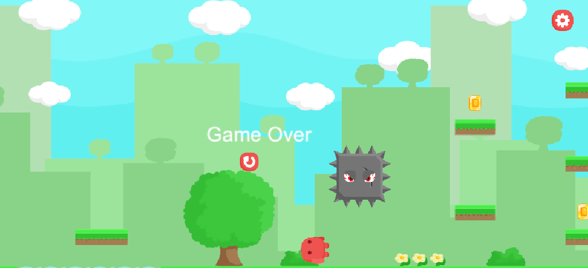

## 🕹️ 2D 平台跳躍遊戲

## 這是一款使用 Unity 製作的簡單 2D 橫向卷軸跳躍遊戲，具備基本的移動、跳躍、收集硬幣與陷阱功能。

## 🎮 遊戲玩法

- 使用 ← → 鍵控制角色移動
- 按 `Alt` 鍵進行跳躍（支援二段跳）
- 收集硬幣來獲得勝利
- 避開陷阱與水池，否則會扣血或死亡
- 可在 UI 中控制音量、靜音與設定選單

---

## 📂 專案簡介

- `Assets/`：主要資源（腳本、場景、圖片等）
- `Scripts/`：包含玩家控制、音效、陷阱邏輯等腳本
- `Scenes/`：包含主遊戲場景與封面場景
- `Prefabs/`：硬幣、陷阱等預製件
- `README.md`：專案說明文件

---

## 📦 技能

- C# 程式邏輯（平台控制、跳躍次數、動畫狀態）
- 音效管理（UISoundManager、背景音樂控制）
- UI 系統（開始遊戲、設定面板、音量控制）

---

## 🔧 開發環境

- Unity 2021+
- Visual Studio 或 Rider

---

## 🖼️ 遊戲畫面預覽

🎮 遊戲封面

🏃 玩家角色動作

🏁 通關畫面

---

## 👨‍💻 作者

- 姓名 :陳榆 / GitHub 帳號 123Ryo:
